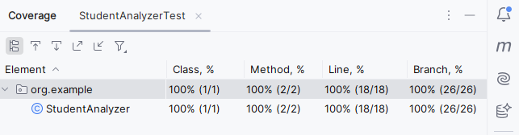

# 🎓 Bài tập Java: Phân tích điểm số học sinh

## 📋 Mô tả

Lớp `StudentAnalyzer` gồm các phương thức dùng để phân tích danh sách điểm của học sinh. Bài tập này yêu cầu bạn triển khai các hàm xử lý logic, đồng thời viết hoặc chạy các test để kiểm tra tính đúng đắn.

---

## 🧮 Chức năng chính

1. **`countExcellentStudents(List<Double> scores)`**
   - Trả về số học sinh có điểm **Giỏi** (điểm ≥ 8.0)
   - Bỏ qua các điểm không hợp lệ (âm hoặc > 10)
   - Nếu danh sách rỗng hoặc `null` → trả về `0`

2. **`calculateValidAverage(List<Double> scores)`**
   - Tính **điểm trung bình** của các điểm hợp lệ (trong khoảng [0, 10])
   - Nếu không có điểm hợp lệ → trả về `0.0`

---

## ▶️ Hướng dẫn chạy kiểm thử

### ✅ Cách 1: Sử dụng IntelliJ IDEA

1. Mở project bằng IntelliJ IDEA
2. Mở file `StudentAnalyzerTest.java`
3. Nhấn chuột phải vào class hoặc method cần test → chọn **"Run with Coverage"**
4. IntelliJ sẽ tự động chạy test và hiển thị báo cáo độ bao phủ (coverage) trong phần **Run / Coverage**

### 📈 Cách xem kết quả coverage

Sau khi chạy test với coverage, bạn sẽ thấy:

- **Bảng thống kê độ phủ (%)** ở tab **Coverage**
- **Màu sắc hiển thị trên mã nguồn**:
   - 🟩 Dòng màu xanh lá: đã được kiểm thử
   - 🟥 Dòng màu đỏ: chưa được kiểm thử

#### Kết quả coverage:

| Tệp               | Line Coverage | Branch Coverage |
|------------------|---------------|-----------------|
| `StudentAnalyzer.java` | 100%          | 100%              |

> 📝 Sử dụng phím tắt: Nhấn `Ctrl + Alt + F6` (hoặc vào menu `Run → Show Coverage Data`) để xem lại kết quả coverage bất kỳ lúc nào.

---

